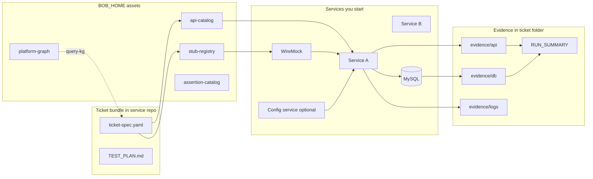

# Bob the Builder — Developer Guide

**Bob the Builder** — ticket-driven local validation for backend microservices.  
**CLI:** `python bob.py <command>` — command names describe what they do (`init-ticket`, `validate-ticket`, …). See [BOB_CHEATSHEET.md](BOB_CHEATSHEET.md).  
**Audience:** Developers adopting or presenting the framework.  
**Scope:** This `bob-the-builder` repository (runner + assets + local), ticket bundles under each **host** service repo `docs/tdd-runs/` — not product-domain docs (KYC, bulk, etc.).

---

## Executive summary

**Problem:** Backend tickets need repeatable local proof — correct gateway APIs, partner/bank stub behavior, DB rows, logs — without manual Postman + grep + SQL every time.

**Solution:** One **`ticket-spec.yaml`** per ticket, catalogs and stubs in **local Bob home**, automated **`bob validate-ticket`** runs, and an **evidence bundle** (`RUN_SUMMARY.md`, `REPORT.html`, `evidence/`). Cursor skills split **analyst / implementer / verifier**.

**One-liner:** Stubs → only the **services your ticket needs** → gateway APIs → logs + DB → evidence.

---

## Architecture (end-to-end)



**Pipeline:**

```text
Ticket -> ticket-spec.yaml -> feature branch -> implement -> validate-ticket -> evidence/
```

Layers: [`runner/ARCHITECTURE.md`](../runner/ARCHITECTURE.md).  
ADR: [`ARCHITECTURE_REVIEW.md`](ARCHITECTURE_REVIEW.md).

---

## Key concepts

| Concept | What it is | Where |
|--------|------------|--------|
| **Ticket spec** | Single source of truth: scenarios, stubs, config URL overrides, DB presets | `docs/tdd-runs/<id>/ticket-spec.yaml` in **host service repo** |
| **API catalog** | Gateway API defs (`api_id`, path, headers); grows via `discover-apis` | `{BOB_HOME}/api-catalog/` |
| **Stub registry** | Reusable WireMock fixtures by **partner operation** | `{BOB_HOME}/stub-registry/` |
| **Assertion catalog** | Optional DB/log presets per `impacted.feature` | `{BOB_HOME}/assertion-catalog/` |
| **Platform graph** | APIs, processors, stubs (from host repo scan) | `{BOB_HOME}/platform-graph/` |
| **Reference examples** | Optional CC/LOC snapshot for copy/compare — not loaded by Bob | `{BOB_HOME}/examples/novopay-cc/` |
| **Session / agent memory** | Last runs, KG slice for Cursor | `{BOB_LOCAL}/agent/` |
| **Env profile** | Example ports, health checks, schema names | `deploy/tdd/env-*.yaml` in host repo |
| **Workspace root** | Parent folder of **all** service git clones | `BUILDER_WORKSPACE_ROOT` |
| **BOB_HOME** | Shared catalogs (api, stubs, graph) | `bob-the-builder/assets` |
| **BOB_LOCAL** | Secrets + agent session | `bob-the-builder/local/` (gitignored) |
| **Workspace map** | Which repos exist, `application.properties` paths | `deploy/tdd/workspace-services.yaml` |
| **Evidence** | Proof per scenario | `docs/tdd-runs/<id>/evidence/` |

### Agent roles

| Role | Skill (`bob-the-builder/skills/`) | Does | Does not |
|------|-------------------|------|----------|
| **Analyst** | `builder-analyst` | Spec + test plan + `discover-apis` | Implement, validate, commit |
| **Implementer** | `builder-implementer` | Code + unit tests | Full validation run |
| **Verifier** | `builder-verifier` | `validate-ticket` → evidence | Change code to fake green |
| **One-shot** | `builder-one-shot` | End-to-end orchestration | — |

---

## Directory map

| Path | Purpose |
|------|---------|
| `bob-the-builder/runner/` | Bob engine (this repo) |
| `bob-the-builder/bob.py` | CLI entry (this repo) |
| `{workspace}/bob.py` | Optional thin launcher (`bob install --launchers` only) |
| `deploy/tdd/` | Example env profile + **workspace-services.yaml** (in **host** repo) |
| `deploy/application/orchestration/` | Discovery source in the **active host** repo |
| `docs/tdd-runs/<id>/` | Ticket spec + evidence |
| `{BOB_HOME}/` | Shared catalogs, stubs, platform graph |
| `{BOB_LOCAL}/user.env` | Workspace root, MySQL, service URLs (machine-local) |
| `{BOB_LOCAL}/agent/` | Session graph, KG slice for Cursor |

---

## Workspace (multi-repo)

All service repositories sit under **one parent directory**. Bob asks for that path once (`bob setup`).

```text
{BUILDER_WORKSPACE_ROOT}/
  <service-repo-a>/
  <service-repo-b>/
  bob-the-builder/           <- clone: runner + assets + skills
  bob-the-builder/local/     <- user.env, agent session (never commit)
  bob.py                     <- optional launcher (bob install --launchers)
```

Host repos **may** keep `deploy/tdd/workspace-services.yaml` and `deploy/tdd/env-*.yaml` — copy from [`templates/host-deploy-tdd/`](../templates/host-deploy-tdd/README.md) (~2 min). This is **optional** for service boot: Bob can discover peers from host code and properties without any deploy/tdd entry.

**Workflow:**

1. Read `ticket-spec.yaml` → `impacted.repos`, `gateway_apis`, `stubs`.
2. **Start required services** — manually, or let Bob do it:
   - `bob ensure-peers` — scan host Java + properties; boot peers not already up
   - `bob need-service <hint>` — one peer (e.g. `notifications`, `consents`)
   - `bob validate-ticket <id>` — auto-boot when `run.auto_boot_services: true` (default) + peer discovery when `run.auto_discover_services: true` (default)
3. If the ticket uses external HTTP partners, run WireMock and apply **config URL overrides** from the spec (`masterdata:` section — only when your platform stores partner URLs in a config DB).
4. Health checks use the **env profile** `services:` list when present, plus any **discovered** peers.

Decision trace shows **workspace_services**, **properties_to_review**, and **service_health** per entry in the profile.

### BOB_HOME vs BOB_LOCAL

```text
{BUILDER_WORKSPACE_ROOT}/bob-the-builder/assets/     # shared catalogs on disk (Bob never git commit/push)
  api-catalog/apis/
  stub-registry/bank-operations/
  platform-graph/platform-graph.yaml

{BUILDER_WORKSPACE_ROOT}/bob-the-builder/local/     # machine-only (gitignored in bob-the-builder repo)
  user.env
  agent/session-graph.yaml
  agent/kg-context-last.md
```

Set paths once in `bob setup`. **No machine path is hardcoded in source** — only `BUILDER_WORKSPACE_ROOT` you enter.

Team workflow: publish `bob-the-builder` as one GitHub repo; `bob install` under your workspace.

---

## Getting started

### Prerequisites

- `bob setup` completed (`BUILDER_WORKSPACE_ROOT`, `BOB_HOME`, `BOB_LOCAL`, MySQL, log dir)
- **Services required by the ticket** running locally (or use `bob ensure-peers` / `validate-ticket` auto-boot)
- **MySQL** (schemas from env profile / ticket-spec `run.audit_db`)
- **WireMock** when the ticket uses `stubs`
- Python 3.11+ and `pip install pyyaml`
- Git (optional): default `git.branch_policy: none` — Bob does not checkout branches. Novopay CC teams set `novopay-feature` in `ticket-spec.yaml` for `ddp-fea-*` checkout (still no commit)

### Commands

```bash
python bob.py setup
python bob.py init-ticket MY-123 "Title"
python bob.py discover-apis
python bob.py sync-graph
python bob.py validate-ticket MY-123
python bob.py ticket-status MY-123
python bob.py open-report MY-123
python bob.py ensure-peers
python bob.py need-service notifications --reason "peer for this flow"
python bob.py help
```

Short aliases still work: `s` `i` `d` `r` `st` `o` — see `bob help`.

Cheat sheet: [BOB_CHEATSHEET.md](BOB_CHEATSHEET.md).

---

## Typical workflow (any ticket, any service)

1. `bob query-graph <keywords>` → `{BOB_LOCAL}/agent/kg-context-last.md`
2. `bob init-ticket <id> "<title>"` — edit `ticket-spec.yaml`; set `git.branch_policy: novopay-feature` only if your team wants feature-branch checkout
3. Analyst: `ticket-spec.yaml`, `TEST_PLAN.md`, stubs under `BOB_HOME`
4. `bob discover-apis` / `bob sync-graph` when orchestration changes
5. Implementer: code in repos under `BUILDER_WORKSPACE_ROOT`; **no commit** unless asked
6. Start services (`bob ensure-peers` or manual) + WireMock; config overrides from spec
7. Verifier: `bob validate-ticket <id>` → `RUN_SUMMARY.md` / `REPORT.html`
8. Share evidence folder or report only if the team wants ticket examples in git

---

## Seeing and judging runs

| Artifact | Use |
|----------|-----|
| **RUN_SUMMARY.md** | Decision trace, timings, assertions |
| **REPORT.html** | Browser-friendly review |
| **evidence/** | Raw API, DB, logs |

```bash
python bob.py ticket-status MY-123
python bob.py open-report MY-123
```

Session history: `{BOB_LOCAL}/agent/session-graph.yaml`.

---

## One Bob for all services (recommended layout)

**You do not need a full copy of Bob in every GitHub repo.**

| Piece | Where it lives | Committed? |
|-------|----------------|------------|
| **Runner** (CLI, engine) | `{workspace}/bob-the-builder/` (this repo only) | `bob-the-builder` git repo |
| **Shared catalogs** | `BOB_HOME` (`bob-the-builder/assets`) | Same repo `assets/` |
| **User prefs + session** | `BOB_LOCAL/user.env`, `BOB_LOCAL/agent/` | Never |
| **Ticket bundles** | **Active service repo:** `docs/tdd-runs/<id>/` | Optional per team |
| **Orchestration / deploy/tdd** | **Active service repo** (auto-detected from `cd`) | Per service |

**Auto-attach:** After `bob setup`, when your shell is inside any git clone under `BUILDER_WORKSPACE_ROOT`, Bob uses that repo as the **host**:

- `discover-apis` / `sync-graph` read **that** repo’s orchestration
- `init-ticket` / `validate-ticket` use **that** repo’s `docs/tdd-runs/`
- Sibling repos can be started via **`bob ensure-peers` / `need-service`** (dynamic) or **`workspace-services.yaml`** + ticket `impacted.repos` (profile-based)

Override: `BOB_HOST_REPO=/absolute/path/to/clone`.

### Workspace install (one folder next to all repos)

Clone **only** `bob-the-builder` next to service repos, then:

```bash
cd bob-the-builder
python bob.py setup
python bob.py install
cd ../novopay-platform-creditcard-management
python ../bob-the-builder/bob.py validate-ticket MY-123
# or, after `bob install --launchers`: python ../bob.py validate-ticket MY-123
```

Other services only need `deploy/tdd/` + `docs/tdd-runs/` if they host tickets — **no** copy of the runner in each repo.

Framework patterns in a host repo (e.g. `AbstractProcessor` vs transaction managers) are **documented in that repo’s rules** — not required for every backend service.

**External integrations:** Point partner URLs at WireMock via ticket-spec `masterdata:` rows **when** your stack reads URLs from a configuration service database. Stubs live in `{BOB_HOME}/stub-registry/`.

### Does a “config / masterdata” service need to run?

**No — not for every ticket.**

| Ticket needs | Start config service? |
|--------------|------------------------|
| Gateway APIs only, URLs in service `application.properties` | **No** |
| Unit tests only | **No** |
| WireMock stubs + URL rows in **configuration table** (Novopay pattern) | **Yes** — so the **primary service** can load stub URLs at runtime |
| Direct mock in service config (no config DB) | **No** — set URLs in that service’s properties instead |

Example: many credit-card flows load HDFC URLs from masterdata **configuration** — then both the **API service** and **config service** run for E2E. A bulk-upload or internal-only ticket might need **only** the API service.

`bob setup` may ask for a config-service base URL for health checks — **press Enter to skip** if your ticket does not use it.

---

## Local stack (configured, not fixed)

Example profile: [`deploy/tdd/env-local-dsa.yaml`](../deploy/tdd/env-local-dsa.yaml) — **rename or duplicate** for your tenant.

| Profile block | Meaning |
|---------------|---------|
| `services.*` | Base URL env vars + health paths Bob probes |
| `mysql.schemas` | Example schema names for DB asserts |
| `run.wiremock_port` | Stub port in ticket-spec |

**Start order:**

1. `bob setup`
2. MySQL (+ Redis/Kafka only if your ticket needs them)
3. **Novopay microservices:** `bob ensure-peers` or `validate-ticket` (auto-boot) — **not** bank/HDFC (WireMock only)
4. WireMock when using `stubs`
5. Apply config SQL from ticket run folder if generated
6. Restart services after config URL changes

### Service boot commands

| Command | When |
|---------|------|
| `bob ensure-peers` | Implementing / testing / stubs — scan host code + properties; boot what is down |
| `bob need-service NAME` | You know one peer (`notifications`, `consents`, `masterdata`, …) |
| `bob discover-services` | List peers only; `--boot` to start all |
| `bob start-services` | Boot from env profile keys |
| `bob stop-services` | Stop Bob-started `bootRun` processes |

Discovery sources: env profile `services:`, host `application.properties` localhost URLs, Java imports (`in.novopay.infra.notifications`, …), `local/agent/required-services.yaml`. Peer repos must exist under `BUILDER_WORKSPACE_ROOT` with `gradlew`.

Prefs come from `bob setup` (`BOB_LOCAL/user.env`) — map to whatever appears in your env profile’s `base_env_var` names.

---

## Skills and CI

| When | Skill |
|------|-------|
| Full flow | `builder-one-shot` |
| Spec only | `builder-analyst` |
| Code only | `builder-implementer` |
| Run only | `builder-verifier` |

CI in the host repo may smoke-check orchestration XML only; **catalogs are local** — run `bob discover-apis` after API changes.

---

## Per-ticket customization

| Piece | How |
|-------|-----|
| APIs | `bob d` then `steps[].api_id` in ticket-spec |
| Partner stubs | `stubs[].ref` under Bob home registry |
| DB | `scenarios[].db` + optional assertion catalog feature file |
| Services | `impacted.repos` + workspace map |
| Unit tests | `verification_level: unit` + `gradle_tests` |

---

## FAQ

**Q: API not in catalog?**  
A: `bob discover-apis`, then edit `{BOB_HOME}/api-catalog/apis/<api>.yaml`.

**Q: Service still calls real partner URL?**  
A: Config URLs must point at WireMock; restart the service that reads config after SQL.

**Q: DB assert wrong?**  
A: Align `MYSQL_*` in `{BOB_LOCAL}/user.env` and `run.audit_db` in ticket-spec with your schema.

**Q: No logs?**  
A: Set `LOGS_DIR` to the directory that contains your service log files.

**Q: Growing YAML in git by mistake?**  
A: Catalogs belong in `{BOB_HOME}` only; host repo keeps README pointers.

---

## Read next

| Doc | Contents |
|-----|----------|
| [BOB_CHEATSHEET.md](BOB_CHEATSHEET.md) | Short commands |
| [runner/README.md](../runner/README.md) | Quick start |
| [runner/ARCHITECTURE.md](../runner/ARCHITECTURE.md) | Internals |
| Host `deploy/tdd/workspace-services.yaml` | Example repo layout (per service repo) |
| Host `deploy/tdd/env-local.yaml` | Example env profile (per service repo) |
| [`templates/host-deploy-tdd/README.md`](../templates/host-deploy-tdd/README.md) | Copy-paste host glue pack |

---

## Presentation outline (30–45 min)

| # | Topic | Min |
|---|--------|-----|
| 1 | Problem / solution (any backend ticket) | 3 |
| 2 | Architecture + Bob home vs service repo | 5 |
| 3 | Workspace + `application.properties` | 5 |
| 4 | `setup` / `init-ticket` / `validate-ticket` / `ticket-status` demo | 8 |
| 5 | ticket-spec walkthrough | 5 |
| 6 | Agent roles | 4 |
| 7 | FAQ + cheatsheet | 5 |
| 8 | Q&A | 5 |

---

*Bob the Builder: service-agnostic validation; engine in `bob-the-builder/` only; host repos carry tickets and deploy profiles.*

**Improvement backlog:** [NEXT.md](NEXT.md) — run `bob next` after each session to see or update what to tackle next.
