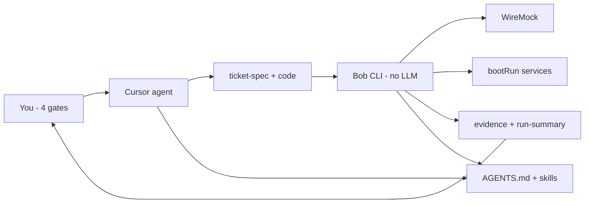

# Bob ego boost (builder intel)

**For:** You only - resume, interviews, remembering what is already baked. **Not** in README or docs index.  
**Find anytime:** `bob builder-intel --open`, `builder-intel --open` (after `bob path-shim`), or `bob ego-boost`.  
**Squad doc:** [BOB_GUIDE.md](../BOB_GUIDE.md) · **Public repo:** https://github.com/trusttAshutosh/bob-the-builder

**Read this doc only** before an interview. ~15 min refresh. Engineer-level AI usage, not ML research.

**Inventory below the system map is auto-maintained** from `product-features.yaml` and open `NEXT.md` items — no manual edits.

---

## How to talk about "vibecoding" Bob (without sounding lazy)

**Truth:** You used Cursor heavily to write code fast. That is not the product story.

**Product story:** You designed a **system** - spec-driven proof, deterministic CLI, CI-guarded features, structured evidence - and used AI to **implement faster**. That is normal 2025+ engineering, not skipping engineering.

| If they imply… | You say… |
|----------------|----------|
| "You just prompted an AI" | "The LLM is Cursor's. **I own the architecture**: ticket spec, proof pipeline, WireMock boot, eval baselines, CI feature registry, contract governance." |
| "No real testing" | "Bob **is** the test harness: `validate-ticket` runs unit + API + DB + log + Kafka/Redis scenarios; `run-summary.json` + `REPORT.md`; `bob eval` for regression; pytest on the runner." |
| "Will it work in prod?" | "Bob is **local proof before ship** - same idea as CI integration tests, but with bank stubs and multi-service boot. Not a prod deploy tool." |
| "Do you understand it?" | Use [Interview walkthrough](#interview-walkthrough-3-stories) — `run_flow`, gates, one failure story (below). |

**Resume angle:** Built an open-source **agent-assisted TDD/proof platform** for Spring microservices - not "built GPT."

---

## Elevator pitches

**30 sec:** Ticket-driven local proof CLI: WireMock bank, boot Novopay services, run scenarios from YAML, write evidence + gates. Cursor plans/codes; Bob proves deterministically.

**2 min:** Problem = manual Postman/SQL/grep every ticket. Solution = `ticket-spec.yaml` + `bob validate-ticket` → `REPORT.md`, `GATE_SUMMARY.md`, `evidence/`. Plus agent skills, hybrid graph retrieval for context, eval baselines, onboard for squad. Public on GitHub; CI verifies registered product features (see auto inventory).

**5 min:** Use [Interview walkthrough](#interview-walkthrough-3-stories) below — `run_flow`, gates, one failure story. If they ask *why* you built it: [Five themes](#five-themes-product-senior-ai-team-action) (product + squad empathy + bias for action).

---

## Five themes: product, senior, AI, team, action

**How to use:** Pick **one line per theme** on resume; in interviews, tie answers to **artifacts** (repo path, command, doc) — never adjectives without proof.

| Theme | What Bob proves (fact) | Resume phrase (pick one) | Interview one-liner |
|-------|------------------------|--------------------------|---------------------|
| **Product sense** | Scoped **local proof before ship**, not prod deploy or "another AI"; `ticket-spec.yaml` + gates match how squads actually work; `BOB_GUIDE.md` = one KT doc; `assets/examples/sample-validate-output/` = demo without clone-and-boot | "Identified integration-proof gap on bank-backed microservices; shipped ticket-driven CLI with evidence bundles and explicit Plan/Build/Prove/Ship gates" | "I didn't build a chatbot — I built the **smallest product** that removes repeated Postman/SQL/grep and gives the squad a shared definition of done." |
| **Senior engineering** | Agent vs **deterministic prover** split; `run_flow.py` pipeline; CI feature registry + doc-invariants + contract governance; freshness bug → `repos_requiring_fresh_boot()` + tests; tradeoffs documented (lexical graph vs vector DB) | "Architected agent-assisted TDD platform: non-deterministic IDE agent + replayable Python proof pipeline, CI-guarded contracts, eval regression on scenario PASS/FAIL" | "Senior here means **boundaries**: LLM for speed, YAML + CLI for truth, humans for ship — and encoding production lessons (fresh JVM, boot remediation) in code, not runbooks." |
| **Updated with AI** | Cursor + skills; hybrid retrieval; tool bridge; HITL gates; [AI concepts table](#ai--agent-concepts-interview-table) maps to real code | "Applied agentic patterns (tool use, grounding, eval, context engineering) to enterprise integration workflow — open repo, honest scope" | "I know the 2025+ agent stack; Bob is **applied** AI — supervisor gates, deterministic tools, repo-native RAG without embedding ops." |
| **Empathy for team** | `bob onboard` one command; `bob doctor` / path-shim for Windows friction; orchestrator model (dev approves 4 gates, not 40 chores); `bob remind`; memory-budget + chat-hygiene; post-commit keeps NEXT/inventory fresh; sample output for reviewers | "Reduced squad cognitive load: single onboard, standardized evidence (`REPORT.md`, `GATE_SUMMARY.md`), self-serve diagnostics (`bob doctor`)" | "I optimize for **the next engineer** — clone, onboard, validate-ticket, read REPORT — not for hero debugging in DMs." |
| **Bias for action** | Public GitHub; dogfood on real CC tickets; boot/freshness fixes shipped with tests; failures → `boot_remediation.py`, not slides; open `NEXT.md` backlog; meta-review suggests, human approves rule changes | "Shipped OSS proof platform used on production-adjacent tickets; iterated from dogfood failures (stale JVM, boot flakiness) into automated remediation" | "I ship a thin vertical slice, run it on a real ticket, fix what breaks, **encode the fix in Bob** — then document once in BOB_GUIDE." |

### Behavioral questions → which story to tell

| They ask… | Lead with… | Proof pointer |
|-----------|------------|---------------|
| Product judgment / prioritization | Five themes **Product** row + scoped "not prod LLM" | `BOB_GUIDE.md` Full vs minimal TDD; sample output bundle |
| Senior / architecture | Story 1 (`run_flow`) + design choices (no LangGraph) | `run_flow.py`, `graph_retrieval.py` |
| AI fluency | [AI table](#ai--agent-concepts-interview-table) + vibecoding section | `bob eval`, `CONTEXT_PACK.md`, skills in repo |
| Team / mentorship / empathy | Five themes **Team** row + Story 3 Option B (boot in tool not chat) | `bob onboard`, `bob doctor`, `templates/onboarding/` |
| Bias for action / ownership | Story 3 Option A or B + public repo | GitHub, `test_boot_plan.py`, `boot_remediation.py` |
| Conflict / skepticism ("AI slop") | Story 3 Option C + contract governance | `doc-invariants.yaml`, `verify-all` in CI |

### 60-second "why I'm proud of this project"

"I saw the squad burning time on the same local proof steps every ticket — bank stubs, boot, SQL, logs — while the agent could write code faster than we could **verify** it. I shipped Bob as a **product**: ticket spec, deterministic validate-ticket, evidence the whole team can read, gates that respect the human as orchestrator. I used Cursor heavily to implement, but the architecture — prover split, eval baselines, doc contracts, onboard in one command — is what makes it senior work. It's public, dogfooded on real tickets, and when freshness or boot bit us, I fixed the **tool**, not the wiki."

---
## System map

**Roles:** Cursor = plan/build (non-deterministic). Bob = prove (deterministic). You = approve Plan/Build/Prove/Ship.

<!-- BUILDER_INTEL:AUTO:START -->
## Auto-maintained inventory (do not edit this section)

**Synced:** 2026-06-22 · commit `f4f2b3b` · **20** registered features · **48** CLI handler commands.

Source of truth: [`product-features.yaml`](../product-features.yaml). Refreshed by `bob verify-product --update` and the post-commit hook.

| Feature | ID | CLI commands |
|---------|-----|--------------|
| Core CLI entry | `cli-core` | — |
| Workspace setup & install | `workspace-setup` | `setup`, `install`, `install-hooks`, `verify-fresh-install` |
| Ticket init, validate, status, reports | `ticket-lifecycle` | `init-ticket`, `validate-ticket`, `ticket-status`, `open-report`, `list-tickets` |
| Knowledge graph (platform + session) | `knowledge-graph` | `sync-graph`, `query-graph`, `update-graph` |
| API catalog discovery | `api-discovery` | `discover-apis` |
| Gradle bootRun + dynamic peer discovery | `service-boot` | `start-services`, `stop-services`, `services-status`, `need-service`, `discover-services`, `ensure-peers` |
| Stub registry & WireMock runtime | `stub-wiremock` | — |
| Git branch policy (default none) | `git-branch-policy` | — |
| Empty live BOB_HOME catalogs | `assets-empty-live` | — |
| CC reference pack (examples only) | `examples-novopay-cc` | — |
| Sample validate-ticket output bundle | `sample-validate-output` | `refresh-samples` |
| Improvement backlog & reminders | `improvement-backlog` | `next`, `remind`, `verify-product` |
| Host deploy/tdd template | `host-deploy-template` | — |
| Cursor builder skills | `agent-skills` | — |
| PATH shim (bob on PATH) | `path-shim` | `path-shim`, `doctor` |
| Stale workspace cleanup | `workspace-cleanup` | `cleanup-workspace` |
| Feature integrity verifier | `product-verify` | `verify-product`, `verify-docs`, `verify-all`, `verify-contract-governance` |
| Evidence bundle + verify docs (DB, logs, Kafka, Redis) | `evidence-and-verify` | — |
| Redis verify + evidence capture | `redis-verify` | — |
| MCP-ready tool bridge (local default) | `mcp-tool-bridge` | `tools` |

### Planned (open in NEXT.md)

- **[Next]** **Header profiles** — today single profile `dsa-agent-app`; add neutral template + example under `assets/examples/`
- **[Next]** **Second reference pack** — e.g. `assets/examples/novopay-payments/` when a second service dogfoods Bob; contribution flow in [CONTRIBUTING_REFERENCE_PACKS.md](../CONTRIBUTING_REFERENCE_PACKS.md)
- **[Later]** **Windows validate-ticket** — document bash requirement; expand Python fallback parity with `run-tdd.sh`
- **[Later]** **Orchestration-less hosts** — discovery today requires `deploy/application/orchestration/`; support OpenAPI-only or Gradle route scan as alternative

<!-- BUILDER_INTEL:SYNC=2026-06-22:f4f2b3b -->
<!-- BUILDER_INTEL:AUTO:END -->

---

## AI / agent concepts (interview table)

Know the **term**, **how Bob uses it**, and **one sentence** - not paper depth.

| Concept | In Bob | Say in interview |
|---------|--------|------------------|
| **Agentic workflow** | Cursor loops; Bob executes proof | "Agent plans and codes; CLI **observes and verifies** - classic plan/act/observe split." |
| **Human-in-the-loop** | 4 gates; you ship; meta-review doesn't auto-change rules | "Automation produces evidence; **humans approve** scope and merge." |
| **Skills / playbooks** | builder-* skills, not auto-on | "Fixed-role prompts with contracts - analyst doesn't run validate." |
| **Spec-driven testing** | `ticket-spec.yaml` drives scenarios | "Proof inputs are **YAML**, not chat memory." |
| **RAG / grounding** | CONTEXT_PACK + graph + catalog | "Agent context from **repo-derived graph**, not whole-repo @." |
| **Hybrid retrieval** | Lexical + graph expand (`graph_retrieval.py`) | "BM25-lite + neighbor walk - no vector DB required." |
| **Tool use** | Agent runs `bob validate-ticket`; optional MCP bridge | "LLM calls **deterministic tools**; local subprocess default." |
| **Eval regression** | `bob eval` vs `eval-baseline.json` | "Golden proof runs - same mindset as LLM evals, on PASS/FAIL scenarios." |
| **Context engineering** | memory-budget, one ticket per chat | "Designed for **finite context** - archive, resume files, budget status." |
| **Guardrails** | doc-invariants, contract governance | "Policy-as-code; weakening CI rules needs typed **APPROVE**." |
| **Determinism boundary** | Bob replayable; Cursor is not | "Source of truth is **run-summary.json**, not model output." |
| **Service virtualization** | WireMock for bank | "Partner APIs stubbed for **repeatable** local integration." |
| **Supervisor / orchestrator** | You approve 4 gates; Bob runs `run_flow` | "Supervisor-worker: human orchestrator, deterministic worker CLI." |
| **Golden datasets** | `eval-baseline.json` snapshots scenario PASS/FAIL | "Offline eval on proof artifacts - same discipline as LLM golden sets." |
| **Workflow pipeline** | `run_flow.py` ordered steps | "Explicit pipeline, not LangGraph - debuggable and CI-guarded." |

### Applied AI syllabus → Bob (honest map)

Maps agentic-AI / applied-AI curriculum topics to **what Bob actually implements**. Use **Partial** honestly; use **Not in Bob** to show you know the ecosystem without over-claiming.

| Topic | Status | Bob reality (if asked) |
|-------|--------|-------------------------|
| AI agents / agent loops | **Used** | Cursor plans and edits; Bob executes and records proof. |
| LLM fundamentals (consumer) | **Used** | Cursor is the model surface; no training or serving stack. |
| Prompt engineering | **Partial** | Skills, rules, ticket-spec - no prompt registry or A/B prompt versioning. |
| Planning / task decomposition | **Used** | 4 gates, `ticket-spec.yaml`, skill role split. |
| Reflection / self-critique | **Partial** | `bob meta-review`, doc audits - not an autonomous reflect loop. |
| Tool calling / function calling | **Used** | `validate-ticket`, `query-graph`, `eval`; optional MCP bridge. |
| RAG / grounding | **Used** | `CONTEXT_PACK.md` + hybrid retrieval - **repo graph**, not embeddings. |
| Vector DB / embeddings / dense retrieval | **Not in Bob** | Lexical + graph expand in `graph_retrieval.py` by design. |
| Knowledge bases | **Used** | Platform graph, API catalog, session graph. |
| Context engineering | **Used** | `memory-budget`, one ticket per chat, resume files. |
| Short-term / long-term memory | **Partial** | Chat hygiene + `AGENTS.md` / `TICKET_RESUME.md` - no vector memory store. |
| Single-agent vs multi-agent | **Partial** | Cursor subagents optional; Bob runner is one deterministic pipeline. |
| Orchestration / supervisor pattern | **Used** | Human = supervisor (gates); Bob = worker (`run_flow.py`). |
| MCP | **Partial** | `mcp-tool-bridge`, `mcp-audit`; local subprocess is default. |
| Workflow graphs / state machines | **Used** | Hand-rolled step graph in `run_flow.py` - not LangGraph. |
| Human-in-the-loop | **Used** | Ship gate; contract changes need typed `APPROVE`. |
| Agent evaluation / golden datasets | **Used** | `bob eval` vs `eval-baseline.json` on scenario PASS/FAIL. |
| Observability / tracing | **Partial** | `run-summary.json` timings + `evidence/` - not LangSmith/Phoenix. |
| Guardrails / output validation | **Used** | `doc-invariants.yaml`, contract governance, CI feature registry. |
| Production AI (scale, cost, security) | **Partial** | Local proof tool: determinism, stubs, CI - not model routing or semantic cache. |
| LangGraph / LangChain / CrewAI / AutoGen | **Not in Bob** | Deliberate: explicit Python pipeline beats framework magic for debuggability. |
| Fine-tuning / LoRA / quantization | **Not in Bob** | Out of scope - integration proof, not model training. |
| Browser / computer-use agents | **Not in Bob** | Backend Spring + CLI proof only. |

**Design choices (say once if they probe "why not vector RAG / LangGraph?"):**  
Bob's domain is **structured** - APIs, processors, stubs, and tickets already live in YAML graphs and catalogs. **Hybrid lexical + one-hop graph expansion** grounds agents without embedding infra, re-index jobs, or vector DB ops on every dev laptop. **Deterministic CLI proof** (`run-summary.json`, eval baselines, doc invariants) is the reliability layer; the LLM is an accelerator, not the source of truth. That is applied agentic AI for **enterprise integration TDD**, not a generic chatbot stack.

**30-min cram before interview:** read [Interview walkthrough](#interview-walkthrough-3-stories) aloud once, then skim both tables above.

---

## Interview walkthrough (3 stories)

Practice these out loud. **Facts only** — no self-rating. Point interviewer at repo + `assets/examples/sample-validate-output/` if they want proof.

### Story 1 — Walk `run_flow` (~2 min)

**Open with:** "`bob validate-ticket` is one orchestrated pipeline in `runner/lib/run_flow.py`. It reads `ticket-spec.yaml` and writes evidence — not the LLM."

**Pipeline in order** (say roughly this):

| Phase | What Bob does | Code / artifact |
|-------|----------------|-----------------|
| 1. Context | Prefs + stale checks + hybrid graph slice | `context_assembly.py` → `CONTEXT_PACK.md` |
| 2. Stubs | Apply stub registry; WireMock mappings; masterdata SQL | `stub_registry.py`, `local/.runtime-wiremock/` |
| 3. Kafka (if in scope) | Discover bindings in impacted code; Docker/topics setup | `kafka_discovery.py`, `KAFKA_VERIFY.md` |
| 4. Boot | `boot_plan`: changed repos bootRun; unchanged mocked or left up; **git code change → restart** | `service_boot.py`, `boot_remediation.py` |
| 5. WireMock + health | Start WireMock; health-check gateway/services | steps in `run-summary.json` |
| 6. Scenarios | Unit (Gradle), API calls, DB asserts, logs, Redis/Kafka if spec'd | `evidence/api`, `evidence/db`, … |
| 7. Close | Eval vs baseline; `RunRecorder` → `run-summary.json`; REPORT + **GATE_SUMMARY** | `run_summary.py`, `orchestrator_gates.py` |

**Close with:** "Every step has `duration_ms` in `run-summary.json` — that's how I debug slow boots vs slow API proof."

**If they drill in:** "Bank/HDFC never bootRuns — always WireMock. Real Novopay services boot via Gradle when the ticket needs them."

---

### Story 2 — Four gates (~1 min)

**Open with:** "I'm the orchestrator — I only approve four gates. Cursor and Bob do the work."

| Gate | What it checks | Who / what |
|------|----------------|------------|
| **Plan** | `ticket-spec.yaml`, scenarios, acceptance criteria, `TEST_PLAN.md` | `_assess_plan()` in `orchestrator_gates.py` |
| **Build** | Unit/compile steps in the run (Gradle scenarios) | `_assess_build()` |
| **Prove** | E2E/integration scenarios, boot, stubs, overall PASS | `_assess_prove()` + `REPORT.md` |
| **Ship** | You — checkbox on `GATE_SUMMARY.md` | Human only; Bob never commits |

**Close with:** "Prove is machine-checked from the same run that produced `evidence/`. Ship is always human — that's intentional HITL."

---

### Story 3 — One failure story (~2 min, STAR)

Pick **one** per interview. All real from building/dogfooding Bob.

#### Option A — "Green proof, wrong code" (freshness)

| | |
|--|--|
| **Situation** | Retesting with "bob let's test again" while CC stayed up between Java edits. |
| **Task** | API scenarios passed but behavior didn't match the fix. |
| **Action** | Traced `start_service`: health UP → skip bootRun. Added `repos_requiring_fresh_boot()` — git diff on `.java`/`.xml`/`.properties` forces stop + restart; lib change restarts host composite. |
| **Result** | Fast retest when nothing changed; fresh JVM when code changed. Documented in `BOB_GUIDE.md`; tests in `test_boot_plan.py`. |

**One-liner:** "I learned proof must distinguish **availability** from **freshness** — health check alone isn't enough."

#### Option B — Boot flakiness (remediation)

| | |
|--|--|
| **Situation** | Local `validate-ticket` failed on service boot — MySQL creds, Kafka, Redis noise on laptops. |
| **Task** | Same failures every session; squad re-debugging in chat. |
| **Action** | `boot_remediation.py`: read `boot.log`, match patterns, escalate Spring override profiles; sync MySQL from `user.env` via `application_props_sync.py`. Encode in Bob, not chat. |
| **Result** | Retries in one run; prefs remembered in `local/user.env`. Still improve: boot-fix registry from history (see NEXT.md Later). |

**One-liner:** "Operational fixes belong in the **tool**, not tribal chat memory."

#### Option C — Vibecoding defense (process)

| | |
|--|--|
| **Situation** | Solo-built Bob quickly with Cursor; needed squad trust + interview credibility. |
| **Task** | Prove it's engineering, not prompt-and-pray. |
| **Action** | `product-features.yaml` + CI; doc-invariants; contract governance with human APPROVE; public repo + sample validate output bundle. |
| **Result** | Repeatable proof anyone can clone and verify; this doc for interview facts. |

**One-liner:** "AI wrote lines; **I own** the contract between agent, prover, and human gates."

#### Option D — Team friction (empathy + action)

| | |
|--|--|
| **Situation** | Squad on Windows + mixed shells; `bob` commands failed inconsistently; ego doc and proof steps hard to find. |
| **Task** | Lower friction without another wiki page nobody reads. |
| **Action** | `path_shim` flat commands (`builder-intel`, `validate-ticket`), `bob doctor` diagnostics, `bob.ps1` / `bob.cmd`; kept maintainer doc buried but one command away. |
| **Result** | Self-serve fix path; public docs stay clean; `verify-docs` enforces the contract. |

**One-liner:** "Empathy is **fewer steps** and clear errors — not more documentation."

---

### 5-minute mock interview (script)

1. **30s** — Elevator pitch (above).  
2. **15s** — One theme hook if relevant: product scope / team onboard / AI boundaries ([Five themes](#five-themes-product-senior-ai-team-action)).  
3. **2 min** — Story 1 (`run_flow` table).  
4. **1 min** — Story 2 (gates).  
5. **1 min** — Story 3: A/B for technical depth, D for team empathy, C for AI skepticism.  
6. **30s** — "Sample output: `assets/examples/sample-validate-output/REPORT.md`"

**Optional deep dive if asked:** open `graph_retrieval.py` — "lexical + graph expand for agent context, not embeddings."

---

## Interview Q&A (standalone)

**What is Bob?**  
Open-source Python CLI + ticket layout for local integration proof on Spring microservices (Novopay/CC-first, generic host profile).

**Did you build an LLM?**  
No. Cursor is the model surface. I built orchestration, proof, evidence, retrieval, and CI around it.

**Hardest technical problem?**  
Repeatable local proof with **real service boot**, **bank stubs**, and **multi-surface checks** (API, DB, logs, Kafka, Redis) without manual glue each ticket.

**How do you test Bob?**  
`runner/tests/` pytest; `bob verify-product` / `verify-docs` / `verify-fresh-install`; dogfood `validate-ticket` on real tickets; sample output bundle in `assets/examples/`.

**Vibecoded = lazy?**  
AI accelerated implementation; **design and verification are explicit**: feature registry, doc contracts, evidence artifacts, eval baselines. Walk [Story 1 + gates](#interview-walkthrough-3-stories) — that's the understanding check.

**Cursor vs Bob - why both?**  
Cursor doesn't boot Gradle, apply WireMock mappings, or emit squad-standard `REPORT.md`. Bob doesn't write Java. Split keeps proof **repeatable**.

**Your daily workflow?**  
"bob let's test" → `validate-ticket`. No code change → services stay up (fast). Java/XML change → auto restart boot targets. Unit scenarios in ticket + API proof.

**What would you build next?**  
See **Planned (open in NEXT.md)** in the auto inventory section above.

**How does this show product sense?**  
Problem = repeated manual integration proof; solution = smallest shippable product (spec + CLI + evidence + gates), not scope creep into prod AI or generic test framework. One squad doc (`BOB_GUIDE`), demo bundle without full boot, backlog in `NEXT.md`.

**How does this show seniority?**  
Clear system boundaries, CI-enforced contracts, tests on failure fixes, explicit tradeoffs (hybrid graph vs vector DB; hand-rolled pipeline vs LangGraph). You can walk `run_flow` and explain *why* each phase exists.

**How are you updated on AI?**  
Consumer + architect of agent workflows: tool use, grounding, eval, context engineering — implemented in repo, not course keywords. See [Applied AI syllabus map](#applied-ai-syllabus--bob-honest-map).

**How does this show empathy for the team?**  
`bob onboard`, `bob doctor`, standardized artifacts, orchestrator rules so devs aren't operators, sample output for reviewers, boot fixes encoded so the next person doesn't re-hit the same laptop issues.

**Bias for action — example?**  
Public repo + real ticket dogfood; Option A/B in [Story 3](#story-3--one-failure-story-2-min-star) — ship fix + test + doc in the same loop.

**Links for interviewer**  
Repo: https://github.com/trusttAshutosh/bob-the-builder · User doc: `docs/BOB_GUIDE.md` · Sample proof: `assets/examples/sample-validate-output/`

---

## Proof artifacts (what to mention if asked "show me")

| Artifact | Proves |
|----------|--------|
| `run-summary.json` | Machine-readable steps, ms, scenarios, assertions |
| `REPORT.md` | Human proof + slowest steps |
| `GATE_SUMMARY.md` | Plan/Build/Prove/Ship |
| `evidence/` | api, db, logs, kafka, redis, unit |
| `eval-baseline.json` | Regression anchor |

---

## Resume bullets (pick 2-4 total — mix themes)

**Product + scope**

- Identified repeated local integration-proof work on bank-backed Spring services; shipped **Bob the Builder** (OSS): ticket YAML → deterministic `validate-ticket` → `REPORT.md` / `GATE_SUMMARY.md` / `evidence/` — local proof before ship, not a prod deploy or LLM product.
- Defined **Plan / Build / Prove / Ship** gates and one squad guide (`BOB_GUIDE.md`) so "done" is shared; sample validate output bundle for review without full environment boot.

**Senior engineering**

- Architected **agent + deterministic prover split**: Cursor for plan/implement; Python CLI for replayable proof (`run_flow.py`); CI registry (20 features), doc-invariants, contract governance with human approval.
- Hardened proof correctness: **fresh JVM on unstaged Java only** (`git_boot_changes.java_unstaged_boot_changes`; host restarts when composite lib changes, not peer services), boot remediation from logs, eval regression on scenario PASS/FAIL; pytest + `verify-all` on the runner.
- **E2E-first validate-ticket** (`run.e2e_first`, `run.fail_fast_on_e2e_block`): integration/e2e scenarios before unit; skip unit when E2E is blocked so agents fix env/WireMock instead of substituting Gradle tests.
- **Cursor hook runner read-only** after `bob onboard` / `deploy_cursor_hooks` — prevents accidental edits; Windows uses `pythonw` so hooks do not open a console.

**AI / applied agentic**

- Applied modern agent patterns in production workflow: tool calling (`validate-ticket`, `query-graph`), repo-native grounding (hybrid graph retrieval), context assembly, golden-run eval — LLM as accelerator, YAML/CLI as source of truth.
- Open-sourced agent-assisted TDD platform with honest scope (no vector DB / no custom model training); public repo with CI-verified product features.

**Team empathy + enablement**

- Reduced squad setup friction: **`bob onboard`** (one command), **`bob doctor`** / path shims, standardized evidence layout; orchestrator workflow so engineers approve gates instead of memorizing ad-hoc steps.
- Encoded recurring laptop/boot failures into the tool (`boot_remediation`, `user.env` sync) — fixes persist for the next developer, not tribal chat.

**Bias for action**

- Shipped and dogfooded OSS proof CLI on real credit-card / Novopay tickets; iterated from failures (stale services, boot flakiness) into automated fixes with tests and docs in the same PR loop.

**Compact LinkedIn / summary line (optional)**

- Built Bob the Builder (OSS): ticket-driven local TDD for Spring microservices — agent-assisted plan/build, deterministic proof, squad-ready evidence; product-focused scope, senior boundaries, team-first onboarding.

---

*Ego boost = interview map. Feature inventory auto-syncs from product-features.yaml.*
